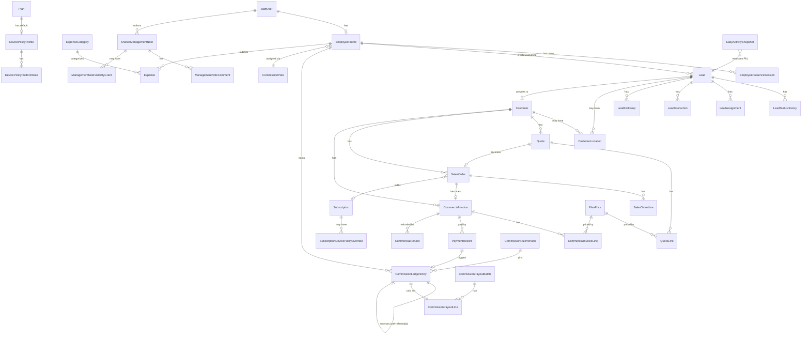

# Phase 9.5A — Entity Relationship Design

## Core relationships (new tables only; existing Customer/Subscription/License/Installation/Plan/
PaymentRecord relationships are unchanged — see Phase 6/8 documentation for those)

## Cardinality notes worth calling out explicitly

- `StaffUser ||--o| EmployeeProfile`: exactly one profile per account, DB-enforced `UNIQUE`, but a
  `StaffUser` can exist without a profile yet (`PENDING` onboarding window) — hence `o|` not `||` on
  the profile side.
- `Lead ||--o| Customer`: a lead converts to **at most one** customer (enforced by
  `Customer.converted_from_lead_id` being set exactly once, at conversion time, never reassigned) — but
  a `Customer` may exist with `converted_from_lead_id = NULL` (created directly, bypassing the lead
  pipeline — still fully valid per existing Phase 5 behavior, unchanged).
- `CommissionLedgerEntry ||--o| CommissionLedgerEntry` (self-referential via `reversal_of_ledger_entry_id`):
  a reversal always points to exactly one original entry; an original entry may have at most one
  reversal in this phase's foundation scope (a real business rule — "you can't reverse the same
  commission twice" — enforced at the service layer, Milestone 22, not a DB constraint this phase).
- `DailyActivitySnapshot` has **no foreign key** into any other table — it reads everything, is
  referenced by nothing (matches `domain-dependency-rules.md`'s Reporting-context rule exactly).
